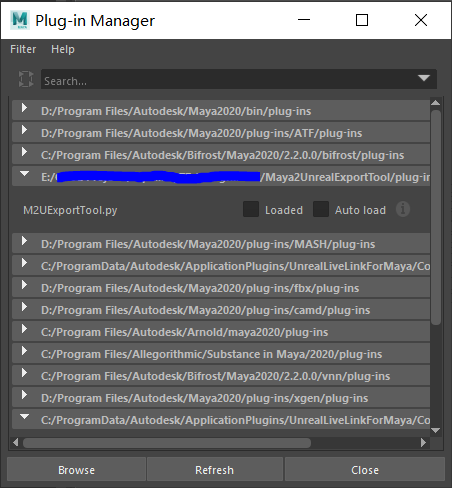
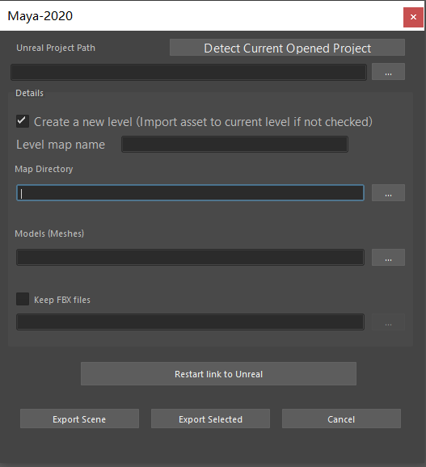

# Maya Scene Exporter
This one-click tool can be used to automatically transfer mesh data in Maya scene towards Unreal game level. 

The manual way to export Maya scene to Unreal engin can be seen on the official website:

<https://knowledge.autodesk.com/support/maya/learn-explore/caas/CloudHelp/cloudhelp/2022/ENU/Maya-DataExchange/files/GUID-51B5F746-12B0-4AB5-9701-A0A740D0ADA5-htm.html#:~:text=Select%20File%20%3E%20Send%20To%20Unreal%2C%20then%20select%20All%20(to,file%20into%20your%20Unreal%20level.>.

In this way, the entire Maya scene is exported in a single FBX file and then be imported as sperate mesh data file (uasset file) in Unreal. Therefore, the world transformation of each object is reset as relative transformation, and their pivots are set to the origin of the world coordination. It's really difficult to reset mesh pivot in some old Unreal versions unless you reimport that mesh independently. That could be problematic when using some objects as movable objects in Unreal, especially for procedural transforming.

This tool optimize the data transfer method between Maya and Unreal, making it automatically. It also keep the pivot for each object. Of course, it could generate lots of FBX files as intermediate files. You can choose not to keep these files but recommended to keep them, because it could be convenient to reimport next time.

## **Installation & Presetting**

### **For Maya**

Use the python file in 'Maya2UnrealExportTool' folder to install and unistall the Maya plug-in.

In Python3 environment, locate to the path of Maya2UnrealExportTool and run the following code in terminal:

```
python installModule.py
```
or
```
python installModule.py -d "{Your_Maya_Path}/maya"
```
The later one is for Maya installed in special machine whose location is not a default path.

To unistall the plug-in, use the similar way:
```
python uninstallModule.py
```

After you install the plug-in, you can search it in Maya's Plug-in Manager (Windows > Settings/Preferences > Plug-in Manager).



After you load it, you can open the window via menu tab above the Maya.


### **For Unreal**
(I just used the same instruction from another documentation for this part. The screenshots are from Unreal 5.0 but it is the same way to preset Unreal. Reference:
<https://epicgames.github.io/BlenderTools/send2ue/introduction/quickstart.html>)

First, open Unreal and create a new project. Once your project is open, go to Edit > Plugins.


Search for the "Python Editor Script Plugin" and enable it. Also ensure that the "Editor Scripting Utilities Plugin" is already enabled.


Once you have enabled the plugins, you'll be prompted to restart the editor. Go ahead and restart. Once you've restarted, go to Edit > Project Settings.


Another thing that is useful to enable under Edit > Editor Preferences


Search for "CPU", then under Editor Performance disable "Use Less CPU when in Background". That way unreal continues to update even when it is not the active application, which means the Unreal user interface will update constantly, and you will see your changes update without having to click on the Unreal Editor.


## **How to use**

Open your Maya scene meanwhile keeping your Unreal project opened!
>**__Warning:__** Don't open multiple Unreal editors at the same time, or it could be problematic.
The tool's UI is shown as following:



Click "Detect Current Opened Project", and it will import the path of your current Unreal project automatically. It will also detect the folders prepared for mesh import, level map save and FBX file save. The default path detection uses paths below:
```
{Project_path}/Content/Maps/
{Project_path}/Content/Meshes/
{Project_path}/Content/FBXs/
```
The folders in "*/Content/" are not Unreal's default directories. Of course, you can customize your own path but remember to ensure your paths of level maps and meshes are located in the project folder.

 >**__NOTE:__** FBX file location is not necessary, but a temporary folder will be created in project directory when exporting scene if you don't want to keep FBX files afterwards. Please make sure you have enough storage space for your Unreal project.

 After you click "Export Scene", Maya scene will start to import towards Unreal. You can import selected objects in Maya as well, which is easy for reimport specific mesh.

>**__Warning:__** Exporting selected objects is only to create new mesh data or replace the existed one. It is handy to reimport mesh data towards Unreal but not designed to add specific object into Unreal level map. If you already deleted the object(s) in level map, exporting selected object does not work like what you want.

>**__NOTE:__** The communication between Maya and Unreal uses remote procedural calls (RPC). If there is a connection error, try to click "Restart link to Unreal" button.